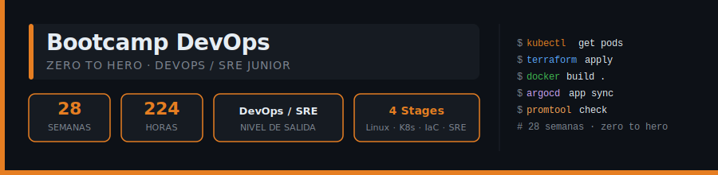

<p align="center">
  
</p>

<p align="center">
  <a href="https://github.com/ergrato-dev/bc-devops/blob/main/LICENSE"></a>
  <a href="#"></a>
  <a href="#"></a>
  <a href="#"></a>
  <a href="#"></a>
  <a href="#"></a>
</p>

---

## 📋 Descripción

Bootcamp intensivo de **28 semanas (~7 meses)** diseñado para llevar a
estudiantes desde cero hasta DevOps/SRE Junior. El enfoque es 100% práctico:
cada semana combina teoría concisa, ejercicios guiados y un proyecto integrador
adaptado al dominio asignado.

> 🏛️ **Política de Dominios Únicos (Anticopia)**: Cada aprendiz trabaja sobre
> un dominio de negocio único asignado por el instructor (e-commerce, farmacia,
> logística, etc.). Esto garantiza implementaciones originales y previene la
> copia entre compañeros.

### 🎯 Objetivos al Egreso

Al finalizar el bootcamp, los estudiantes serán capaces de:

- ✅ Administrar sistemas Linux con seguridad: permisos, procesos, systemd y cron
- ✅ Automatizar tareas con Shell Scripting robusto (`set -euo pipefail`)
- ✅ Gestionar código con Git y colaborar en GitHub mediante Pull Requests
- ✅ Containerizar aplicaciones con Docker, aplicando buenas prácticas de seguridad
- ✅ Orquestar cargas de trabajo en Kubernetes con Helm, RBAC y HPA
- ✅ Provisionar infraestructura como código con Terraform (AWS/GCP)
- ✅ Diseñar e implementar pipelines CI/CD con GitHub Actions
- ✅ Aplicar GitOps con ArgoCD para despliegues declarativos y auditables
- ✅ Implementar observabilidad completa: métricas, logs y trazas distribuidas
- ✅ Aplicar prácticas SRE: SLOs, error budgets, gestión de incidentes y postmortems
- ✅ Integrar seguridad en el ciclo de vida DevOps (DevSecOps)

### 🚀 ¿Por qué este stack?

> **Fundamentos primero, orquestación después** — el orden correcto para
> aprender DevOps sin saltarse pasos críticos.

El bootcamp comienza en Linux y Git (las bases que todo DevOps necesita),
avanza a contenedores y orquestación, y culmina con observabilidad y prácticas
SRE de nivel producción. Las mismas herramientas que usan equipos de
infraestructura reales en empresas de todo el mundo.

---

## 🗓️ Estructura del Bootcamp

| Etapa | Semanas | Horas | Temas Principales |
| :---: | :-----: | :---: | --- |
| **Stage 0** — Fundamentos de DevOps | 1–6 | 48 h | Linux I/II, Shell Scripting, Git, Networking, Cloud Intro |
| **Stage 1** — Contenedores | 7–12 | 48 h | Docker I/II/Compose, Kubernetes I/II/III (Helm, RBAC, HPA) |
| **Stage 2** — IaC & CI/CD | 13–20 | 64 h | Terraform I/II/III, GitHub Actions I/II, GitOps/ArgoCD, Security CI/CD |
| **Stage 3** — Observabilidad & SRE | 21–28 | 64 h | Prometheus, Grafana, Loki, OTel, SRE/SLOs, Incidentes, DevSecOps |

**Total: 28 semanas** | **224 horas** de formación intensiva

---

## 📚 Plan Curricular Semana a Semana

### Stage 0 — Fundamentos de DevOps · Semanas 1–6 · 48 h

| Sem | Directorio | Tema |
|:---:|------------|------|
| 01 | [`week-01-linux_fundamentals_i`](bootcamp/week-01-linux_fundamentals_i/) | Linux I — filesystem, permisos, comandos esenciales |
| 02 | [`week-02-linux_fundamentals_ii`](bootcamp/week-02-linux_fundamentals_ii/) | Linux II — procesos, systemd, usuarios/grupos, cron |
| 03 | [`week-03-shell_scripting`](bootcamp/week-03-shell_scripting/) | Shell Scripting — bash, automatización, manejo de errores |
| 04 | [`week-04-git_and_github`](bootcamp/week-04-git_and_github/) | Git & GitHub — version control, branching, PR, conventional commits |
| 05 | [`week-05-networking_for_devops`](bootcamp/week-05-networking_for_devops/) | Networking para DevOps — TCP/IP, DNS, HTTP/S, SSH, puertos, firewall |
| 06 | [`week-06-cloud_fundamentals`](bootcamp/week-06-cloud_fundamentals/) | Cloud Fundamentals — IaaS/PaaS/SaaS, IAM, regiones, AWS/GCP intro |

### Stage 1 — Contenedores · Semanas 7–12 · 48 h

| Sem | Directorio | Tema |
|:---:|------------|------|
| 07 | [`week-07-docker_i`](bootcamp/week-07-docker_i/) | Docker I — conceptos, imágenes, contenedores, CLI |
| 08 | [`week-08-docker_ii`](bootcamp/week-08-docker_ii/) | Docker II — Dockerfile, multi-stage, optimización, seguridad |
| 09 | [`week-09-docker_compose`](bootcamp/week-09-docker_compose/) | Docker Compose — orquestación multi-contenedor, networking, volumes |
| 10 | [`week-10-kubernetes_i`](bootcamp/week-10-kubernetes_i/) | Kubernetes I — arquitectura, pods, deployments, services |
| 11 | [`week-11-kubernetes_ii`](bootcamp/week-11-kubernetes_ii/) | Kubernetes II — configmaps, secrets, namespaces, RBAC, ingress |
| 12 | [`week-12-kubernetes_iii`](bootcamp/week-12-kubernetes_iii/) | Kubernetes III — Helm, persistent storage, HPA, resource limits |

### Stage 2 — IaC & CI/CD · Semanas 13–20 · 64 h

| Sem | Directorio | Tema |
|:---:|------------|------|
| 13 | [`week-13-terraform_i`](bootcamp/week-13-terraform_i/) | Terraform I — providers, resources, variables, outputs |
| 14 | [`week-14-terraform_ii`](bootcamp/week-14-terraform_ii/) | Terraform II — módulos, state, remote backend, workspaces |
| 15 | [`week-15-terraform_iii`](bootcamp/week-15-terraform_iii/) | Terraform III — VPC, EC2/GCE, RDS, IAM con Terraform |
| 16 | [`week-16-github_actions_i`](bootcamp/week-16-github_actions_i/) | GitHub Actions I — triggers, jobs, steps, runners, contextos |
| 17 | [`week-17-github_actions_ii`](bootcamp/week-17-github_actions_ii/) | GitHub Actions II — matrices, reusable workflows, environments, secrets |
| 18 | [`week-18-gitops_and_argocd`](bootcamp/week-18-gitops_and_argocd/) | GitOps & ArgoCD — principios GitOps, sync strategies, app-of-apps |
| 19 | [`week-19-advanced_pipelines`](bootcamp/week-19-advanced_pipelines/) | Pipelines avanzados — Docker build en CI, tests automatizados, blue-green, canary |
| 20 | [`week-20-security_in_cicd`](bootcamp/week-20-security_in_cicd/) | Security en CI/CD — SAST, image scanning, secrets management, SBOM |

### Stage 3 — Observabilidad & SRE · Semanas 21–28 · 64 h

| Sem | Directorio | Tema |
|:---:|------------|------|
| 21 | [`week-21-prometheus`](bootcamp/week-21-prometheus/) | Prometheus — métricas, exporters, PromQL, scraping |
| 22 | [`week-22-grafana`](bootcamp/week-22-grafana/) | Grafana — dashboards, alertmanager, notificaciones |
| 23 | [`week-23-logging`](bootcamp/week-23-logging/) | Logging — Loki + Promtail + Grafana, ELK intro |
| 24 | [`week-24-distributed_tracing`](bootcamp/week-24-distributed_tracing/) | Tracing distribuido — OpenTelemetry, Jaeger, correlación logs/métricas/trazas |
| 25 | [`week-25-sre_i`](bootcamp/week-25-sre_i/) | SRE I — SLO, SLI, SLA, error budgets, toil |
| 26 | [`week-26-sre_ii`](bootcamp/week-26-sre_ii/) | SRE II — Incident Management, runbooks, postmortems, on-call |
| 27 | [`week-27-devsecops_advanced`](bootcamp/week-27-devsecops_advanced/) | DevSecOps avanzado — Vault, OPA/Kyverno, supply chain security |
| 28 | [`week-28-final_project`](bootcamp/week-28-final_project/) | Proyecto integrador final — pipeline end-to-end completo |

---

## 🗂️ Estructura del Repositorio

```
bc-devops/
├── .github/
│   ├── copilot-instructions.md   # Instrucciones para el agente IA
│   └── workflows/                # GitHub Actions del repositorio
├── assets/                       # Assets globales (banners, diagramas)
├── docs/                         # Documentación general del bootcamp
├── scripts/                      # Scripts de utilidad del repo
└── bootcamp/
    ├── week-01-linux_fundamentals_i/
    ├── week-02-linux_fundamentals_ii/
    ├── ...
    └── week-28-final_project/
```

Cada directorio semanal contiene:

```
week-XX-nombre_del_tema/
├── 0-assets/       # Imágenes y diagramas (preferentemente SVG)
├── 1-teoria/       # Lecciones teóricas en Markdown
├── 2-practicas/    # Ejercicios, scripts, manifests, Dockerfiles, etc.
├── 3-proyecto/     # Reto semanal aplicado al dominio único del estudiante
├── 4-recursos/     # Enlaces y bibliografía
├── 5-glosario/     # Términos relevantes de la semana
└── README.md       # Resumen del tema, objetivos y entregables
```

---

## 🚀 Inicio Rápido

### Prerrequisitos

- **Git** para clonar el repositorio
- **Linux** (Ubuntu/Debian recomendado) o WSL2 en Windows
- **Docker 24+** para los laboratorios de contenedores (semanas 7–28)
- **kubectl** + **kind** o **minikube** para laboratorios locales de Kubernetes
- **VS Code** con las extensiones recomendadas (`.vscode/extensions.json`)

### 1. Clonar el Repositorio

```bash
git clone https://github.com/ergrato-dev/bc-devops.git
cd bc-devops
```

### 2. Semanas 1–6 — Solo Linux & Git

No requiere configuración adicional. Sigue el `README.md` de cada semana.

```bash
# Ir a la primera semana
cd bootcamp/week-01-linux_fundamentals_i
cat README.md
```

### 3. Semanas 7–9 — Docker & Docker Compose

```bash
# Verificar instalación
docker --version
docker compose version

# Ejemplo: levantar un lab de Docker Compose
cd bootcamp/week-09-docker_compose/2-practicas
docker compose up -d
```

### 4. Semanas 10–12 — Kubernetes local con kind

```bash
# Crear cluster local
kind create cluster --name devops-lab

# Verificar nodos
kubectl get nodes

# Destruir cluster al terminar
kind delete cluster --name devops-lab
```

### 5. Semanas 13–15 — Terraform

```bash
cd bootcamp/week-13-terraform_i/2-practicas
terraform init
terraform plan
terraform apply
```

---

## 📊 Metodología de Aprendizaje

### Estrategias Didácticas

- 🎯 **Aprendizaje Basado en Proyectos (ABP)**
- 🧩 **Práctica Deliberada** — laboratorios de complejidad incremental
- 🔄 **Dominios Únicos** — cada aprendiz trabaja en su dominio asignado
- 👥 **Code Review** entre pares
- 🎮 **Live Coding** con infraestructura y pipelines en tiempo real

### Distribución del Tiempo (8 h/semana)

- **📖 Teoría**: 2–2.5 horas
- **🔧 Prácticas**: 3–3.5 horas
- **🏗️ Proyecto**: 2–2.5 horas

### Evaluación

Cada semana incluye tres tipos de evidencias:

1. **Conocimiento 🧠** (30%): Cuestionarios y evaluaciones teóricas
2. **Desempeño 💪** (40%): Laboratorios prácticos ejecutados correctamente
3. **Producto 📦** (30%): Proyecto entregable adaptado al dominio asignado

**Criterio de aprobación**: Mínimo 70% en cada tipo de evidencia

---

## 🛠️ Stack Tecnológico

| Herramienta | Versión | Uso |
|-------------|---------|-----|
| Linux (Ubuntu/Debian) | 22.04 LTS+ | Fundamentos OS |
| Git + GitHub | 2.40+ | Version control |
| Docker + Docker Compose | 24+ | Containerización |
| Kubernetes | 1.30+ | Orquestación (kind/minikube → GKE/EKS) |
| Terraform | 1.x | Infrastructure as Code |
| GitHub Actions | — | CI/CD |
| ArgoCD | 2.x | GitOps |
| Prometheus + Grafana + Loki | — | Observabilidad |
| OpenTelemetry + Jaeger | — | Tracing distribuido |
| HashiCorp Vault | 1.x | Secrets management |

---

## 📝 Convenciones

| Aspecto | Regla |
|---------|-------|
| **Idioma del texto** | Todo el material didáctico y comentarios formativos en **Español** |
| **Idioma técnico** | Código, variables, ramas, recursos cloud e infraestructura en **Inglés** |
| **Scripts Bash** | Siempre inician con `set -euo pipefail` |
| **Docker** | Multi-stage builds · imágenes ligeras (`alpine`/distroless) · sin root · versiones pinadas |
| **Kubernetes** | Manifests declarativos con `requests` y `limits` siempre definidos |
| **Terraform** | `terraform fmt` obligatorio · separar en `main.tf` / `variables.tf` / `outputs.tf` |
| **Package Manager** | `pnpm` con versiones **exactas** — nunca `npm` ni `yarn` |
| **Commits** | Conventional Commits en Inglés · incluir *For* (motivación) e *Impact* (impacto) |

---

## 🤝 Contribuir

¡Las contribuciones son bienvenidas! Este es un proyecto educativo bajo
licencia [CC BY-NC-SA 4.0](LICENSE) — puedes compartirlo y adaptarlo con
atribución, sin uso comercial y manteniendo la misma licencia.

### Cómo Contribuir

1. Haz fork del repositorio
2. Crea tu rama (`git checkout -b feature/nueva-practica`)
3. Commit con [Conventional Commits](https://www.conventionalcommits.org/) (`git commit -m 'feat(week-07-docker_i): add multi-stage build exercise'`)
4. Push a tu rama (`git push origin feature/nueva-practica`)
5. Abre un Pull Request

### 📋 Áreas de Contribución

- ✨ Laboratorios y ejercicios adicionales
- 📚 Mejoras en documentación
- 🐛 Corrección de errores en scripts o manifests
- 🎨 Diagramas SVG de arquitectura
- 🌐 Traducciones
- 🐳 Mejoras a entornos Docker/Kubernetes de laboratorio

---

## 📞 Soporte

- 💬 Discussions: [GitHub Discussions](https://github.com/ergrato-dev/bc-devops/discussions)
- 🐛 Issues: [GitHub Issues](https://github.com/ergrato-dev/bc-devops/issues)

---

## 🏆 Agradecimientos

- [Linux Foundation](https://www.linuxfoundation.org/) — Por los estándares abiertos que hacen posible DevOps
- [CNCF](https://www.cncf.io/) — Por el ecosistema cloud-native (Kubernetes, Prometheus, OTel, ArgoCD…)
- [HashiCorp](https://www.hashicorp.com/) — Por Terraform y Vault, pilares del IaC moderno
- [GitHub](https://github.com/features/actions) — Por GitHub Actions como plataforma CI/CD accesible
- La comunidad open source y todos los contribuidores

---

## 📚 Documentación Adicional

- [🤖 Instrucciones de Copilot](.github/copilot-instructions.md)
- [📖 Documentación General](docs/)

---

## ⚠️ Exención de Responsabilidad

Este repositorio es un recurso educativo de acceso libre, distribuido **tal
como está** (*as-is*), sin garantía de ningún tipo, expresa o implícita.

- El contenido tiene **fines exclusivamente educativos**. No constituye
  asesoramiento profesional en infraestructura, seguridad informática ni
  operaciones para entornos productivos.
- Los autores y colaboradores **no se responsabilizan** por daños directos,
  indirectos o consecuentes derivados del uso, aplicación o mal uso del
  material aquí publicado.
- Los **scripts, manifests y configuraciones de ejemplo** están diseñados
  para entornos de aprendizaje local. **No deben usarse en producción** sin
  una revisión de seguridad adecuada.
- Las **credenciales de desarrollo** incluidas en ejemplos son solo para uso
  local. Nunca las uses en sistemas accesibles públicamente.
- Las referencias a herramientas, libros o servicios de terceros se incluyen
  con fines informativos. Los autores no avalan ni garantizan la
  disponibilidad, exactitud o idoneidad de dichos recursos.
- El material puede contener **errores tipográficos o inexactitudes**.
  Se agradece reportarlos abriendo un
  [Issue](https://github.com/ergrato-dev/bc-devops/issues).

---

<p align="center">
  <strong>🚀 Bootcamp DevOps — Zero to Hero</strong><br>
  <em>De cero a DevOps/SRE Junior en ~7 meses</em>
</p>

<p align="center">
  <a href="bootcamp/week-01-linux_fundamentals_i">Comenzar Semana 1</a> •
  <a href="docs">Ver Documentación</a> •
  <a href="https://github.com/ergrato-dev/bc-devops/issues">Reportar Issue</a>
</p>

<p align="center">
  Hecho con ❤️ para la comunidad DevOps
</p>
